<h1 align="center"> Grocery React</h1>

  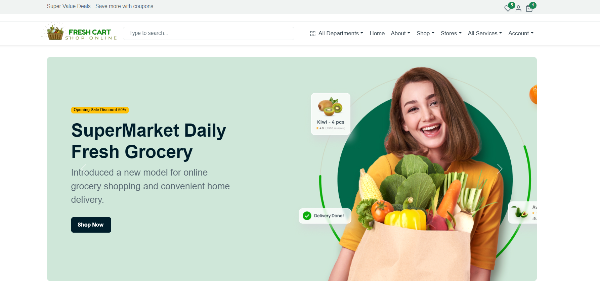
  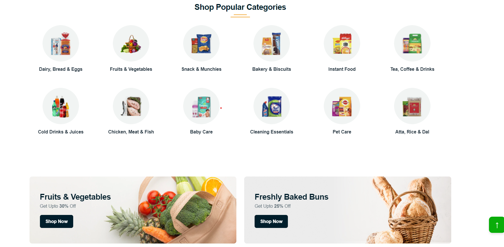
  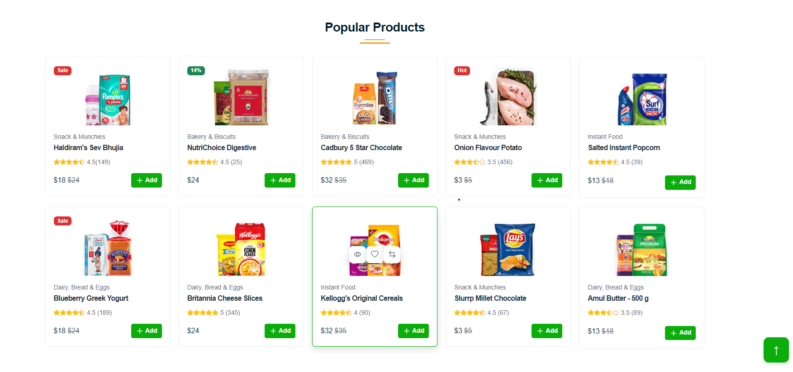
  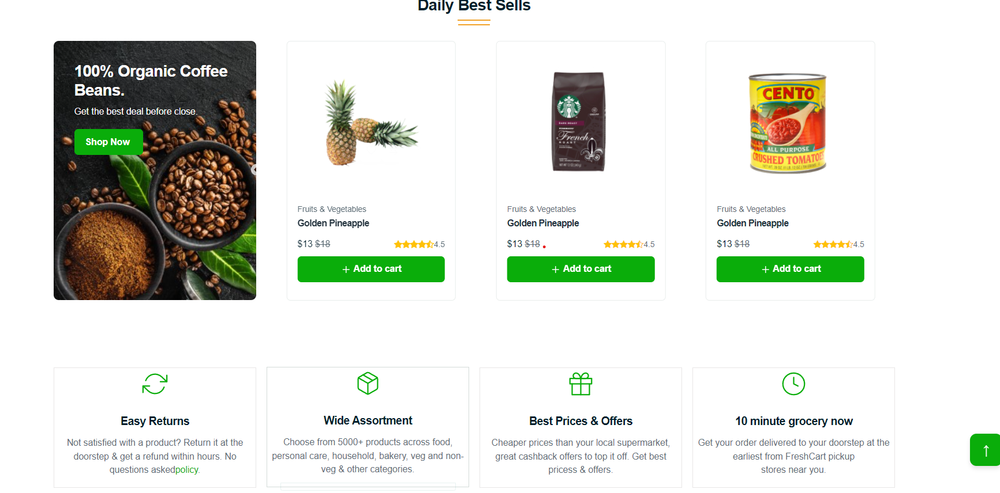
  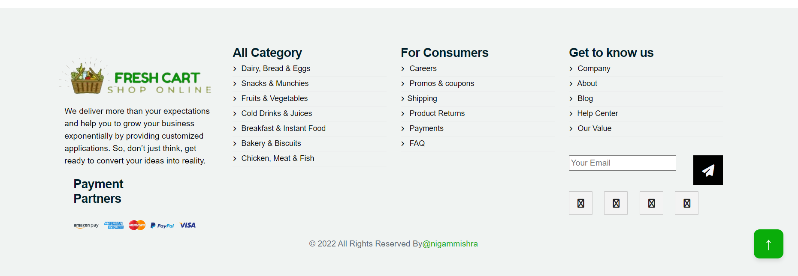
  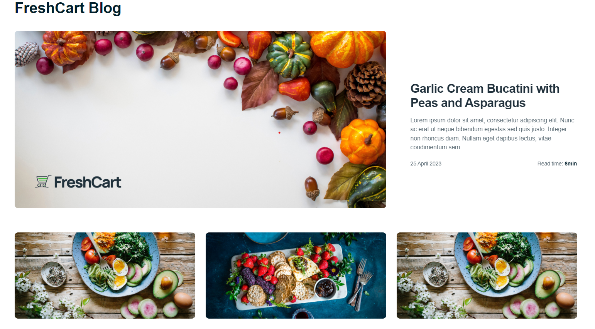
  
  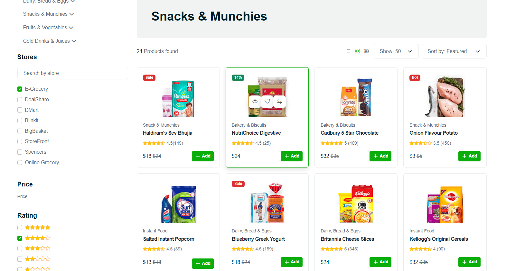
  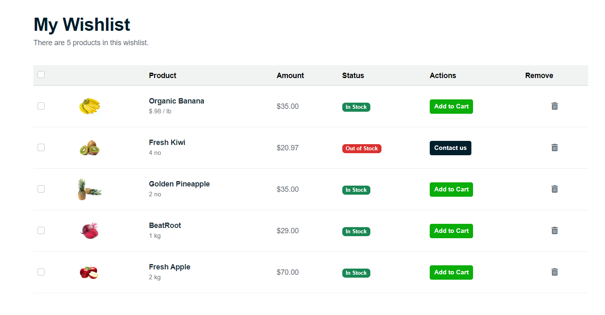
  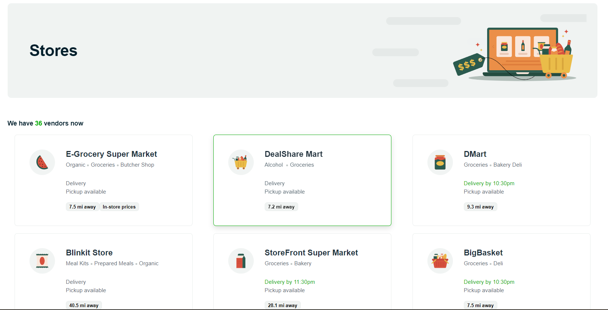
  
  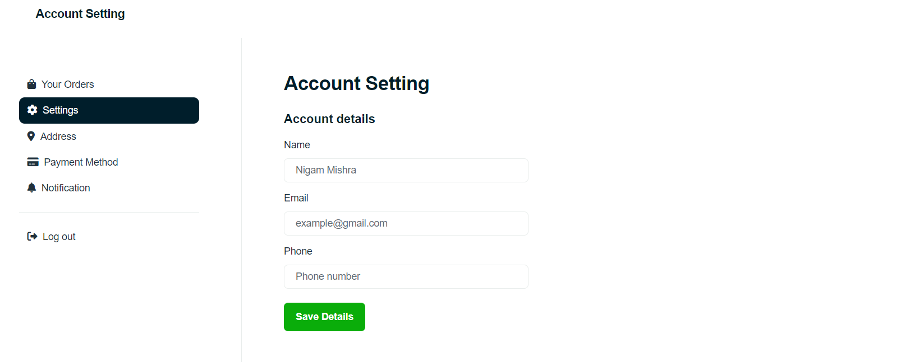
  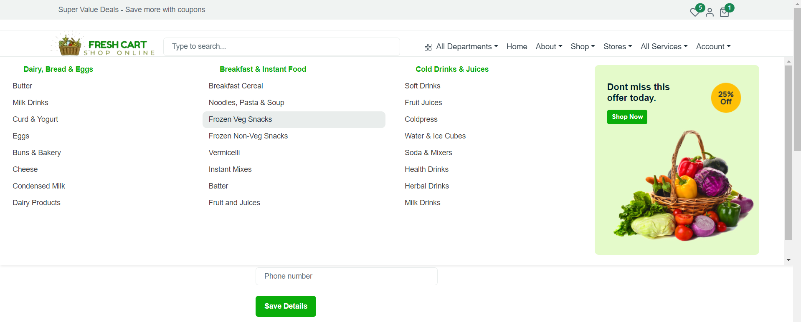
  <!-- 
  
   -->

                        
FreshCart is a beautiful eCommerce React.js template specially designed for multipurpose shops like mega stores, grocery stores, supermarkets, organic shops, and online stores selling products. You can build an impactful store website for your online shop or other similar businesses without grounding things up. Moreover, its clean, minimal, and beautiful design with 100% responsive layouts will hook the visitors at first sight.

<h3>eCommerce Features:</h3>
<ul>
<li>Built on top of Bootstrap5,Bootstrap4 and some React.js Hooks</li>
<li>Clean and minimal design</li>
<li>25+ eCommerce store pages</li>
<li>3 Home pages</li>
<li>3 Different headers</li>
<li>eCommerce Shop Pages
<ul>
<li>Shop Listing</li>
<li>Shop Single</li>
<li>Shop Grid</li>
<li>Shop List</li>
<li>Shop Filter</li>
<li>Shopping cart,</li>
<li>Shop Wishlist</li>
<li>Shop Checkout</li>
<li>Mini Cart page</li>
<li>Quick Popup Design</li>
<li>Customer Reviews</li>
<li>Grid &amp; List layout</li>
<li>Mega menu dropdown</li>
</ul>
</li>
<li>Multi-vendor Store page design</li>
<li>Profile/Account Settings pages
<ul>
<li>Order Details</li>
<li>Account Settings</li>
<li>Payment Settings</li>
<li>Address</li>
<li>Notification</li>
</ul>
</li>
<li>Cross-browser compatibility</li>
<li>Fully responsive</li>
<li>W3C valid code</li>
<li>Well Documented.</li>
</ul>